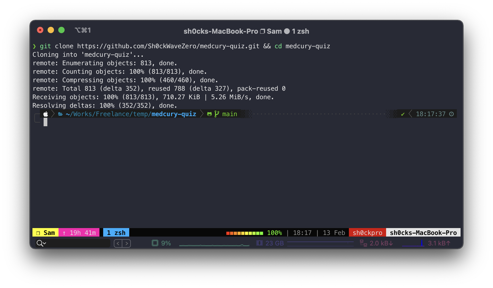
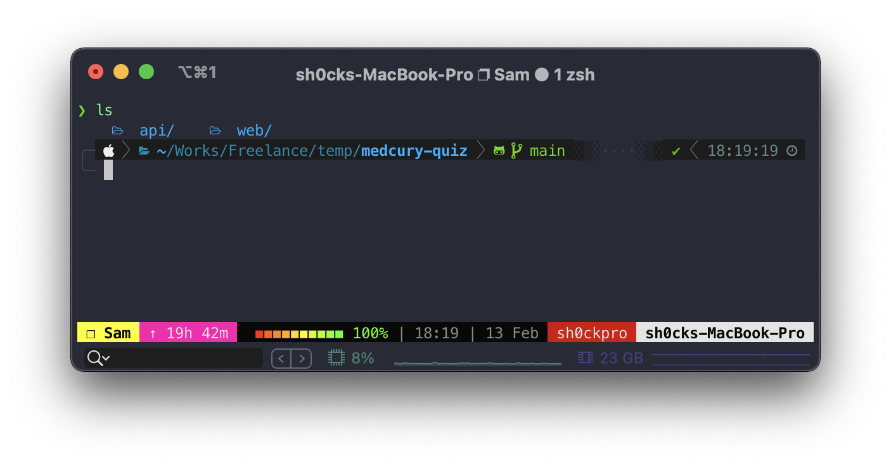
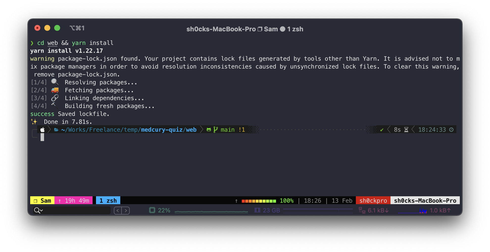

# วิธีการติดตั้ง

โคลนโปรเจ็กลงมาใว้ที่เครื่องก่อน ด้วยการใช้เครื่องมือ Git
*ถ้ายังไม่มีให้ติดตั้งก่อน [Link](https://git-scm.com/)

เปิด Terminal ขึ้นมาแล้วพิมพ์คำสั่ง พร้อมเข้าไปในโฟลเดอร์

```bash
git clone https://github.com/Sh0ckWaveZero/medcury-quiz.git && cd medcury-quiz


```



###### โครงสร้างจะประกอบไปด้วย Fontend และ Backend

* Fontend คือ โฟลเดอร์ web
* Backend คือ โฟลเดอร์ api

```bash
ls


```



### วิธีการรัน Fontend 

ติดตั้ง libraby ก่อน

```bash
cd web && yarn install
```



สั่งให้ fontend ทำงาน

```bash
yarn start
```
